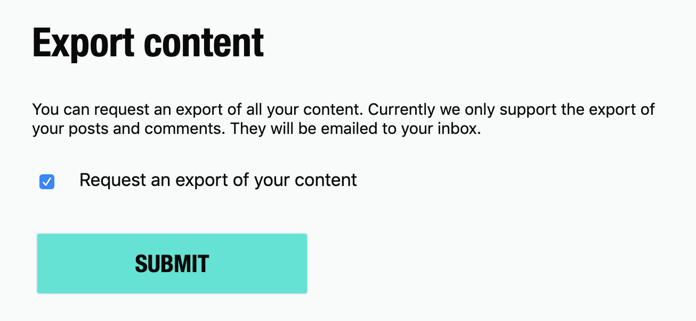

# Dev.to to markdown aka Detom

## Installation

```bash
npm i -g detom
# OR
yarn global add detom
```

## Usage

First, you need to export you're Dev.to content.



You'll receive your data by mail and you just have to provide them to `detom`

The following commande will generate all published articles inside a markdown folder with the following structure `slugified-article-title/index.md`.

```bash
detom articles.json
```

This command will generate the markdown even for unpublished articles

```bash
detom articles.json --all
```

<!--
## Fields

- `title`
- `slug`
- `created_at`
- `main_image`
- `description`
- `published`
- `published_at`
- `processed_html`
- `social_image`
- `body_markdown`
- `canonical_url`
- `show_comments`
- `main_image_background_hex_color`
- `published_from_feed`
- `comments_count`
- `video`
- `video_code`
- `video_source_url`
- `video_thumbnail_url`
- `video_closed_caption_track_url`
- `feed_source_url`
- `positive_reactions_count`
- `edited_at`
- `crossposted_at`
- `language`
- `cached_tag_list`
- `path`
- `cached_user_name`
- `cached_user_username`
- `last_comment_at`
-->
